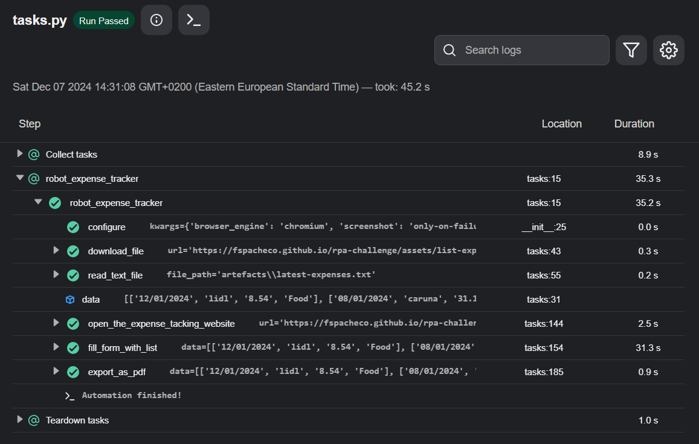

# Expense Tracker Automation

## Members

  - Lahiru Madhusanka Hewawasam Halloluwage, lionwalker, amk1002573@student.hamk.fi

## Summary

  This project automates the process of tracking daily expenses noted in a text file. The script performs the following tasks:

  - __Download the Text File:__ Retrieves the text file containing the expense records from a note-taking app.
  - __Parse and Clean Data:__ Reads and corrects any typing errors in the expense entries.
  - __Fill Website Form:__ Inputs the cleaned expense data into a specified website for tracking purposes.
  - __Generate PDF Report:__ Creates a PDF document that includes a copy of the expense history.
    - Adds a summary line with the category that has the highest expenses.
    - Adds another summary line indicating the shop/company where the highest amount was spent.

  The project ensures an efficient and error-free way to manage and report daily expenses, saving time and reducing manual effort.

---

## Project Structure

  ```
  project/
  │
  ├── artefacts/
  │   ├── latest-expenses.txt
  │   └── PDF.py
  │
  ├── output/
  │   ├── expenses-history-report.pdf  
  │   ├── task-log.png
  │
  ├── .gitignore  
  ├── tasks.py
  ├── conda.yaml
  ├── README.md
  ├── LICENSE
  ├── robot.yaml
  ```

## Setup

### Dependencies

- **Install System Packages**  

  The project requires `wkhtmltopdf` and other system libraries to work with `pdfkit`. hence new dependencies added to `conda.yaml` file:

  ```yaml
  dependencies:
    - pip:
      - pdfkit==1.0.0
         
  apt_packages:
    - wkhtmltopdf
  ```

## Project Workflow

- **Download File**

    The download_file function fetches the text file from the given URL and saves it to the artefacts folder.

- **Read and Sanitize Data**

    - The read_text_file function parses each expense entry.
    - Fixes formatting issues in dates, amounts, and categories.

- **Fill Website Form**

    The open_the_expense_tracking_website and fill_form_with_list functions interact with a browser to populate the website's form fields.

- **Generate PDF**

    - The export_as_pdf function uses a custom PDF class to generate a detailed expense history report.
    - **The PDF includes:**
      - A table of all expenses.
      - Summaries of the highest spending category and merchant.

- **Task Logging**

    Includes a task-log.png image for debugging and visual logs.

## Output Artifacts

  - **Expense Text File:**

    ```artefacts/latest-expenses.txt```

  - **PDF Report:**

    ```output/expenses-history-report.pdf```

    

    Download the [Generated PDF](output/expenses-history-report.pdf)

  - **Task log:**

    